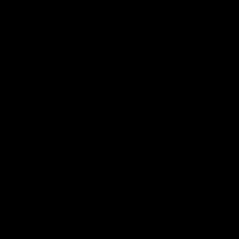
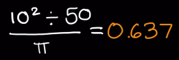
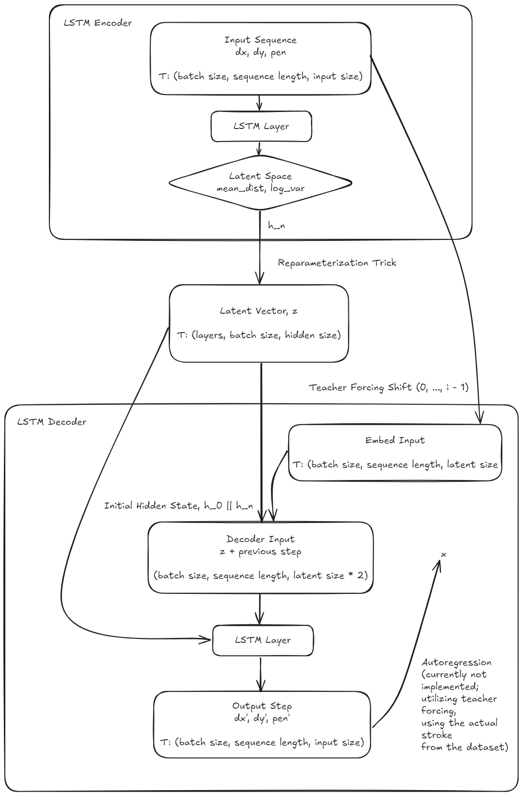

# Neurinese

Chinese characters have almsot no structure or pattern. This project approaches character understanding from a different perspective: modeling the sequence of pen movements used to write a character, enabling realistic handwriting synthesis.



*GIF of teacher forcing reconstruction (not generative yet...)*

## Table of Contents
- [Overview](#overview)
- [Inspiration](#inspiration)
- [Model Architecture](#model-architecture)
- [Getting Started](#getting-started)
- [Milestones](#milestones)

## Overview

Neurinese combines recognition and generation to form an end-to-end handwriting intelligence pipeline:

* Character recognition using a CNN on rendered handwriting
* Character generation using a sequence-to-sequence Variational Autoencoder (VAE)

The generative model is trained on raw stroke trajectories
`(dx, dy, pen state)` and learns a continuous latent space that captures both the structural and stylistic properties of handwritten Chinese characters.

This enables:

* Autoregressive handwriting generation
* Partial stroke completion

## Inspiration

When Apple first released their Math Notes feature back in the Summer of 2024, it especially intrigued me with how they captured the user's handwriting style and generated the answer similar to the handwriting of the user. Users can handwrite equations and see solutions rendered in their own handwriting style.



Rather than simply recognizing symbols, such systems must understand the dynamics of how a user writes.

Neurinese explores this idea in the context of Chinese handwriting by modeling characters as sequences of pen movements. Instead of treating handwriting as a static image, the project focuses on learning stroke-level representations that enable handwriting autocompletion, synthesis, and style-aware generation.

Chinese characters are highly complex and composed of stroke patterns lacking pattern.
While most character reocnigziation rely on CNN-based image recognition, the crucial question this project seeks to answer is: 

> Can a model learn how characters are written, not just what they look like?

This project investigates human-centered AI and generative modeling, focusing on learning representations from the dynamics of handwriting rather than from images alone.

## Model Architecture

### Variational Autoencoder Architecture

This is the model



## Getting Started

### Prerequisites

* Python 3.8+

* PyTorch (preferably with CUDA 13.0)

### Installation

1. Install PyTorch compiled with CUDA via the [official site](https://pytorch.org/). Check NVIDIA CUDA version by running this command in terminal:

    ```bash
    nvidia-smi
    ```

2. Clone this project:

    ```bash
    git clone https://github.com/dark-sorceror/Neurinese.git

    cd neurinese

    pip install -r requirements.txt
    ```

    This includes all the necessary model weights and training data.

3. Run the main file for prototype testing

    ```bash
    python main.py
    ```

## Milestones

* [x] Achieve some sort of model inference of the character
* [ ] Get the autoregressive inference working (learning from itself rather than being observant)
* [ ] Scale up to train on full dataset; no more training on duplicates to enforce overfitting
* [ ] Work toward the autocorrect inference pipeline