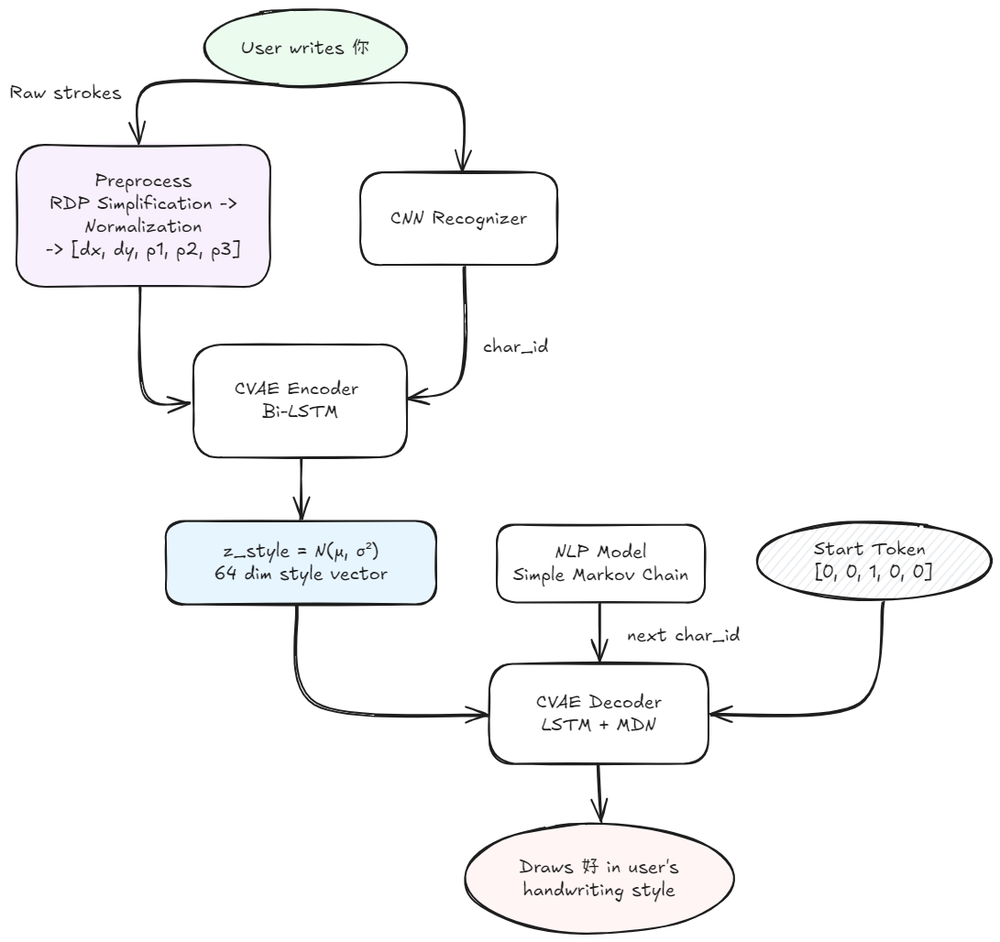
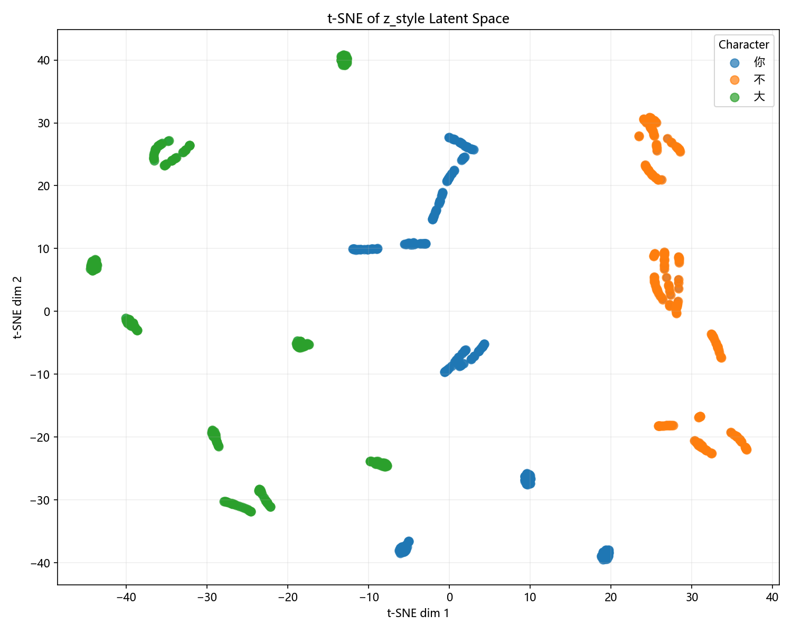
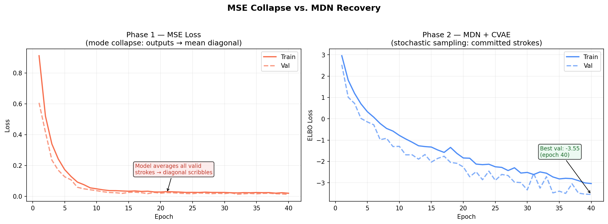
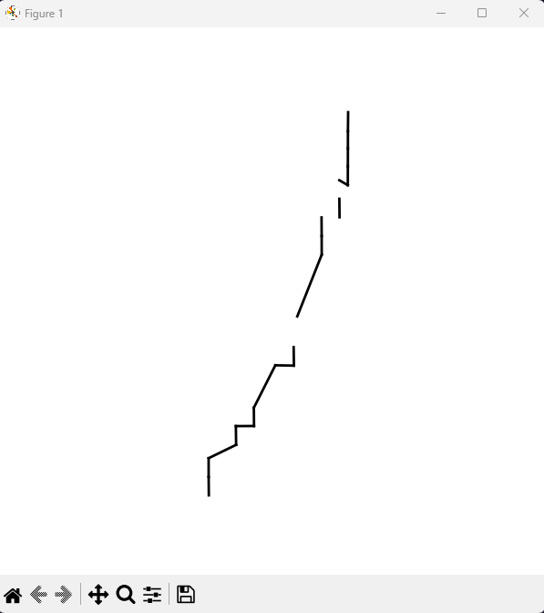

# Neurinese

**Grammarly/Copilot for Handwritten Chinese**

Chinese characters are notoriously difficult to master. Unlike English, where words can be "sounded out" phonetically, Chinese characters often lack obvious patterns between one another. Writing them relies strictly on procedural memory rather than logic.

Personally, when it comes to writing Chinese essays I often find myself forgetting, misremembering, or just straight up not knowing how to write a character. This frusttration led to a question: Can there be a "Grammarly/Copilot" that fixes the errors in a character and autocompletes your ideas seamlessly... in handwritten Chinese???

Neurinese is a real-time handwriting intelligence engine. By combining stroke-level stylistic modeling with semantic language understanding, this projects acts as a real-time "copilot" for handwritten Chinese. Here are the two main features:

1. **Smart Autocompletion** - Recognizes the context of your sentence and generates the next characters automatically in the same handwriting style

2. **Context-Aware Autocorrect** - If you write a character with a slight incorrection, it detects the error, matches it with the context of the sentence and regenerates the correct character to be used, again in the handwriting style of the user


*GIF of the model reconstructing and mimic user handwriting through teacher forcing

## Table of Contents

- [Overview](#overview)
- [Inspiration](#inspiration)
- [Model Architecture](#model-architecture)
  - [Pipeline](#pipeline)
  - [Dataflow](#data-flow-dimensions)
  - [Conditional Variational Autoencoder (CVAE)](#conditional-variational-autoencoder-architecture-cvae)
  - [Mixture Density Network (MDN)](#mixture-density-network-mdn)
  - [Loss functions](#loss-functions)
  - [Natural Language Processing (NLP)](#natural-language-processing-nlp)
  - [Convolutional Neural Network (CNN)](#convolutional-neural-network-architecture-cnn)
  - [Conditional Variational Autoencoder (CVAE)](#conditional-variational-autoencoder-architecture-cvae)
- [Challenges Faced](#challenges-faced)
  - [Multimodality of Handwriting](#multimodality-of-handwriting)
  - [Disentangling Style from Content](#disentangling-style-from-content)
  - [Stroke Simplification](#stroke-simplification)
- [Getting Started](#getting-started)
- [Milestones](#milestones)

## Overview

Neurinese combines recognition and generation to form an end-to-end handwriting intelligence pipeline:

Unlike standard OCR which sees static images, this model learns from raw stroke data:

```
(dx, dy, p1, p2, p3)

dx, dy    relative pen displacement from previous point
p1 = 1    pen is DOWN (stroke is being drawn)
p2 = 1    pen is UP (transition/travel between strokes)
p3 = 1    end of character
```

By modeling the motion rather than the pixels, the system learns a continuous Latent Space that captures two distinct layers of information:

| Layer | What it captures | Handled by |
|---|---|---|
| **Content** | Which character is being drawn | `char_id` (explicit integer label) |
| **Style** | How a specific person writes | $z_{style}$ (64-dim latent vector) |

This enables for an autoregressive handwriting syntehsis ability, where characters can literally be drawn by the model as if you drew it.

## Inspiration

When Apple first released their Math Notes feature back in the Summer of 2024, it especially intrigued me with how it could not only solve equations but render the solution in the user's own handwriting style.


To achieve the handwriting aspect, a system must somehow undersatnd the dynamics of writing rather than simply recognizing symbols. This project aims to explore this concept in the context of handwritten Chinese, whcih inherently lacks any pattern, perfect for model memorization and handwriting synthesis.

Neurinese explores this idea in the context of Chinese handwriting by modeling characters as sequences of pen movements. This project focuses on learning stroke-level embeddings that facilitate autocompletion, synthesis, and style-aware generation.

While most character reocnigziation rely on CNN-based image recognition, the crucial question this project seeks to answer is:

> Can a model learn how characters are written, not just what they look like?

This project investigates human-centered AI and generative modeling, focusing on learning representations from the dynamics of handwriting rather than from images alone.

## Model Architecture

### Pipeline



1. User writes a sequence of characters.
2. The CNN model recognizes and matches the most recent character intended to an actual character, returning the character ID
3. The CVAE Encoder analyzes the strokes to generate a running User Style Embedding ($z_{style}$).
4. The NLP model combines the currently drawn recognized character to analyze the sentence meaning. Two pathways emerge:
    1. If the user drew the character incorrectly given the context of the sentence. The autocorrection decision can be made.
    2. Otherwise, factoring in the current character, the model predicts the next character(s)/phrases if the occurrence is above a threshold
        - Input: `"天气非常 (The weather is very)..."`
        - Prediction: `"好 (Good)" - 85% probability`
        - Except this happens on a handwriting level
5. The system passes the Style Vector ($z_{style}$) and the predicted next character `"好 (Good)"` into the CVAE Decoder.
6. The system draws the character `"好 (Good)"` using the user's specific handwriting characteristics.

### Data Flow Dimensions
 
| Stage | Shape | Notes |
|---|---|---|
| Raw stroke input | `(seq_len, 5)` | `[dx, dy, p1, p2, p3]` one-hot pen state |
| Encoder LSTM input | `(batch, seq_len, 37)` | $\text{stroke} \ (5) + \text{char emb} \ (32)$ concatenated |
| Latent vector $z$ | `(batch, 64)` | Sampled via [Reparameterization Trick](https://medium.com/data-science/reparameterization-trick-126062cfd3c3)  |
| Decoder LSTM input | `(batch, seq_len, 160)` | $\text{stroke emb} \ (64) + \text{char emb} \ (32) + z \ (64)$ |
| Decoder output | `(batch, seq_len, 123)` | $\text{pen logits} \ (3) + \text{MDN params \ (20×6=120)}$ |

### Conditional Variational Autoencoder Architecture (CVAE)

This model learns the handwriting nuance.

The system uses a recurrent VAE architecture (similar to SketchRNN) but obvisouly modified for the high-density stroke constraints and multimodality of Chinese characters. With character conditioning via embeddings to both the encoder and decoder, it forces the latent vector to specialize on style alone.

The pipeline consists of two core components:

1. **Bi-Directional Encoder:** A bi-directional LSTM processes the input sequence of strokes, compressing them into a fixed-length latent vector $z$ which is samples from a Gaussian distribution. This vector acts as a compressed embedding of the character.

2. **Autoregressive Decoder:** An autoregressive uni-directional LSTM conditioned on $z$ from the encoder at each step predicts the probability distribution of the next state `(dx, dy, pen state)` based on previous state and global context.


Because the encoder is tole what character is being drawn via the character ID assigned, the latent vector is forced to capture only the user's stroke dynamics.

This allows us to extract a style from one character the user drew and generate a completely different character in that same style.



*t-SNE of `z_style` - three characters form distinct clusters based on handwriting style*

### Loss Functions

$$
\text{Total Loss} = \text{MDN Loss} + \text{Pen Loss} + \beta(t) \times \text{KL Divergence}
$$
 
| Component | Target | Formula | Purpose |
|---|---|---|---|
| **MDN Loss** | `(dx, dy)` | Negative log-likelihood under GMM | Multimodal stroke position distribution |
| **Pen Loss** | `(p1, p2, p3)` | Cross-entropy on 3-class one-hot | Pen state (down / up / end) classification |
| **KL Divergence** | Latent space | $-0.5 \times \sum[1 + log(\sigma ^2) - \mu ^2 - \sigma ^2]$ | Regularise `z_style` toward $N(0,1)$ |
 
**KL Annealing:** $\beta$ ramps from 0 to 0.05 over the first 20 epochs. This prevents **posterior collapse**, where the decoder learns to ignore $z$ entirely and reconstructs purely from `char_id`, destroying style capacity.
 
**Teacher Forcing with Input Dropout:** 20% of decoder input tokens are randomly zeroed during training, preventing the model from over-relying on exact ground-truth context and improving robustness at inference time.

### Mixture Density Network (MDN)

At any stroke step, multiple next positions are equally valid. There are several pen lifts and fine details in a given Chinese character. A MDN outputs a Gaussian Mixture Model over `(dx, dy)` rather than a single point estimate, following the formulation from 
[Graves (2013) — Generating Sequences with Recurrent Neural Networks](https://arxiv.org/pdf/1704.03477).

```
Per output step:
    pi        [20]   mixture weights          softmax
    mu_x      [20]   x means per component
    mu_y      [20]   y means per component
    sigma_x   [20]   x std devs               exp-activated
    sigma_y   [20]   y std devs               exp-activated
    rho       [20]   x-y correlation          tanh-activated

    MDN params:   20 × 6 = 120
    Pen logits:   3  (p1, p2, p3 - cross-entropy target)

    Total output: 123-dim per step
```

The bivariate Gaussian probability for each mixture component $k$ is:

$$\mathcal{N}(\mathbf{x} | \mu_k, \sigma_k, \rho_k) = 
\frac{1}{2\pi\sigma_x\sigma_y\sqrt{1-\rho^2}} 
\exp\left(\frac{-z}{2(1-\rho^2)}\right)$$

where:

$$z = \frac{(\Delta x - \mu_x)^2}{\sigma_x^2} + 
\frac{(\Delta y - \mu_y)^2}{\sigma_y^2} - 
\frac{2\rho(\Delta x - \mu_x)(\Delta y - \mu_y)}{\sigma_x \sigma_y}$$

The final mixture probability is:

$$P(\Delta x, \Delta y) = \sum_{k=1}^{K} \pi_k \mathcal{N}_k$$

trained by minimising negative log-likelihood. This is the key change that solved mode collapse.

At inference, a mixture component is **sampled**, not argmax. This allows producing committed stroke paths with natural variability rather than averaged smears.

#### Wait, why not use traditional methods like MSE?

The reason for using this is due to the [Multimodality of Handwriting](#multimodality-of-handwriting).



*MSE mode collapse vs MDN recovery*


### Natural Language Processing (NLP)

To understand context.

*Work in progress. Currently is a simple ngram derived from a Markov Chain*. 

This piece is responsible for providing sentence-level context for autocompletion and autocorrect decisions. The NLP model predicts the next `char_id` given sentence context. Its output feeds directly into the CVAE Decoder.

### Convolutional Neural Network Architecture (CNN)

To recognize characters.

This piece is responsible for recognizing partially-drawn characters by rendering strokes to a 64 x 64 image via PIL and mapping them to a character ID. This bridges raw user input to the CVAE conditioning.

## Challenges Faced

### Multimodality of Handwriting

Handwriting is inherently multimodal. Especially in Chinese.

At any point in writing a character, strokes can include:

- Lifting the pen to a new place
- Smooth continuations of a stroke, and oppositely:
- Sudden sharp direction changes

Initial prototypes used standard regression layers and loss functions such as Mean Squared Error (MSE) loss collapsed these possibiilities into their mean, causing the model generation to keep **converging into diagonal suqiggles**. MSE loss forces the model to minimize the average error between these valid optiopns, causing the model to quite literally dodge handwriting nuance and follow through with the predicted mathematical mean of all valid paths rather than comitting to a specific stroke path.



This failure highlights a key insight that I completely missed when approaching the handwriting dynamic.

> Handwriting cannot be learned as a determininistic regression problem

Switching to an MDN with stochastic sampling solved this. The model now samples from a learned distribution, producing strokes that commit to sepcific paths with natural variation.

### Disentangling Style from Content

VAE gives us the style vector, but how do we use it?

The original VAE encoded both what a character looks like and how the user draws it into the same latent vector $z$. Style transfer was impossible with this approach.

Utilizing a CVAE makes the content explicit via a character ID, leaving $z$ specifically tialored to style. The same $z_{style}$ now produces recognizably different characters that share the same stroke style.

### Stroke Simplification

Writing can get messy, and pixels amplify this noise.

Raw input contains thousands of redundant near-collinear points per stroke. Training on this causes the model to get messed up from the noise and not learn the structure properly.

On a network level, this noise introduce potential pattern matching gave hinderance to the LSTM's through the extra size of input and increased differences from each drawing (some points would have a longer sequence length)

I needed a algorithm that could simplify these strokes into straight lines wherever necessary while not leaving out the smaller details such as corners, hooks and directional changes present in a Chinese character.

Doing research, I came across the **Ramer-Douglas-Peucker algorithm**, which reduces each stroke to its geometrically essential points while preserving special elements.

## Getting Started

### Prerequisites

- Python 3.8+
- PyTorch (preferably with CUDA 13.0)

### Installation

1. Install PyTorch compiled with CUDA via the [official site](https://pytorch.org/). Check NVIDIA CUDA version by running this command in terminal:

    ```bash
    nvidia-smi
    ```

2. Clone this project:

    ```bash
    git clone https://github.com/dark-sorceror/Neurinese.git

    cd neurinese

    pip install -r requirements.txt
    ```

    *Note: This includes all the necessary model weights and training data.*

3. Run the main file for prototype testing

    ```bash
    python main.py
    ```

## Milestones

- [x] Achieve some sort of model inference of the character
- [x] Get the autoregressive inference working (learning from itself rather than being observant)
- [x] Style/content disentaglment for latent style vector utillization
- [x] Generate any character in the user's style
- [ ] Scale up to train on full dataset; no more training on duplicates to enforce overfitting
- [ ] Conditioning and encouraging style consistency to predict character writing in foreign characters
- [ ] Incorporate some sort of system to recognize stroke differences between the correct character and the user written character
- [ ] Integrate NLP and CNN to generate semantic understanding
- [ ]  Work toward the autocorrect inference pipeline
- [ ] Scaling and deployment
